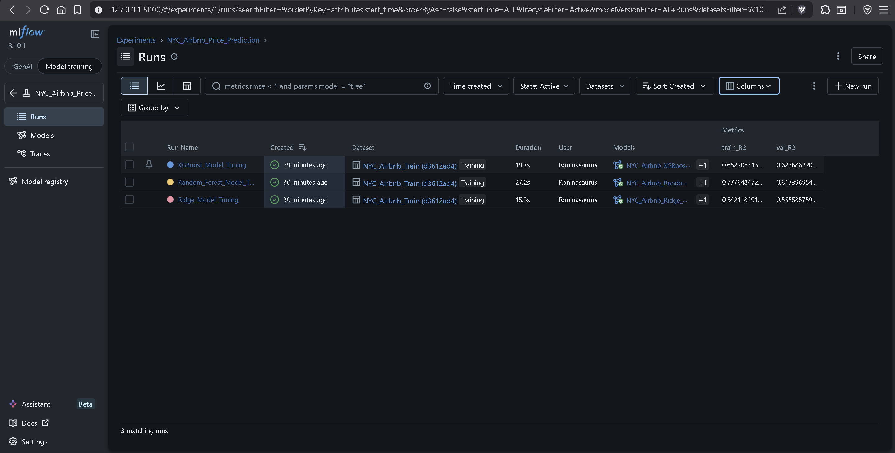
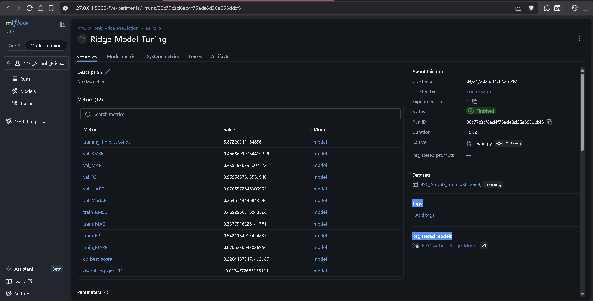
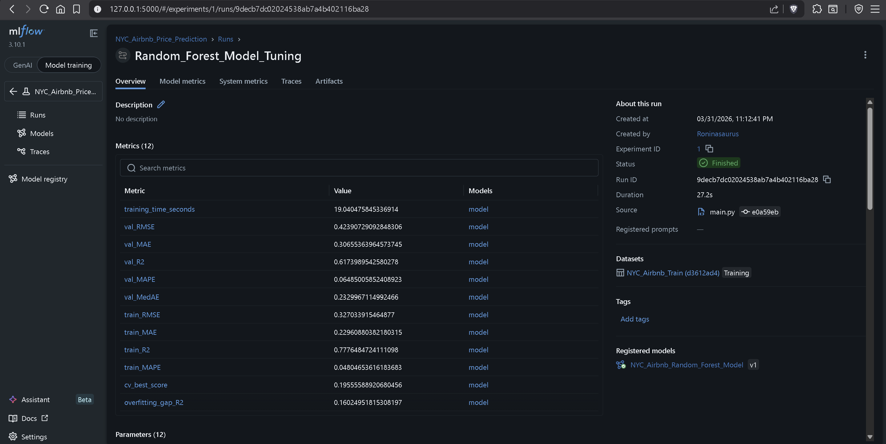
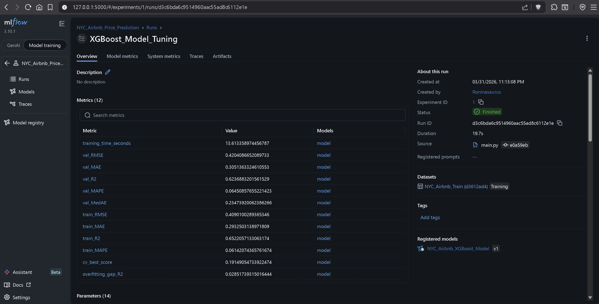
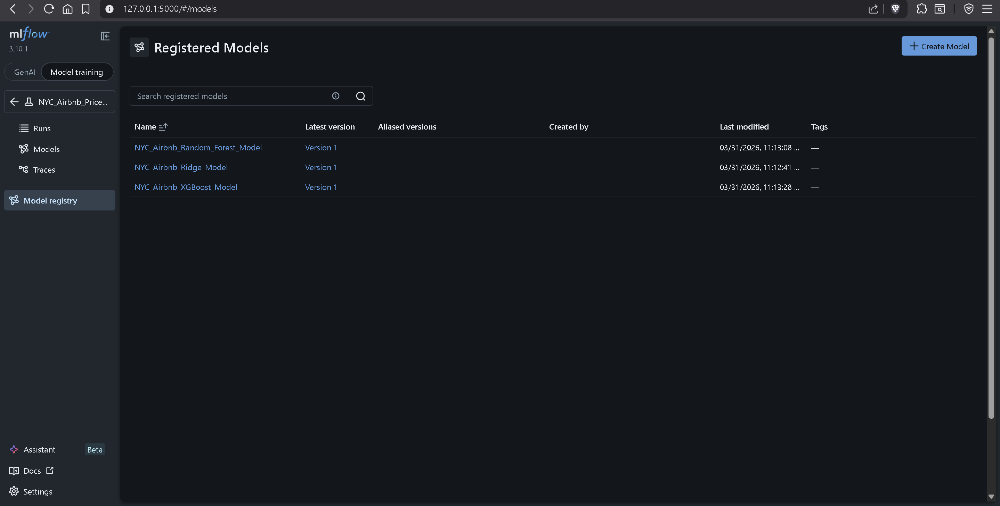

# predict-airbnb-prices
An end-to-end Machine Learning pipeline to predict nightly listing prices using XGBoost, Random Forest, and Ridge Regression, tracked via MLflow.


# Project Objectives
1. Retrieve the Airbnb listings dataset (raw 2019 NYC Airbnb data) from AWS S3 for analysis.

2. Perform end-to-end data preprocessing, including cleaning, feature engineering, and outlier handling.

3. Develop and compare multiple regression models (ridge, random forest and xboost) to predict nightly listing prices.

4. Track all experiments using MLflow (log parameters, metrics like RMSE, MAE, R², MAPE, and model artifacts) and register the best models.


# Setup and execution instructions
## 1. Setup Environment (external depenedencies + editable local install):

```
pip install -r requirements.txt
pip install -e .
```

## 2. Execute Pipeline:
```
python main.py
```

## 3. View Dashboard:
```
mlflow ui
```
Then navigate to http://localhost:5000 in your web browser.

# Project structure
```
predict-airbnb-prices
├── notebooks/      
│   ├── eda.ipynb    
├── screenshots/        # Contains screenshots of important project checkpoints
│   ├── mlflow/     
├── src/                # All Python source code (.py files)
│   ├── ingest.py       
│   ├── preprocess.py   
│   └── train.py      
└── main.py             # start point of experiment pipeline  
├── mlruns/             # generated for MLflow
├── requirements.txt    
└── README.md
└── setup.py            # editable install for cross referencing files within project

```


# Screenshots of MLflow UI

1. Experiment runs


2. Metrics

    a. Ridge 
    

    b. Random Forest
    

    c. XG Boost
    

3. Model registry


*more screenshots like parameters and artifacts (including feature_importance in tree-based models) are available in screenshots/*


# Key observations and insights:

## Observations:

* All three models have similar validation MAE (~0.23-0.31) and RMSE (~0.42-0.46)

1. Ridge (Worst performance)

    Val R²: 0.5556 (55.56%)

    Val MAPE: 7.07%

    Train R²: 0.5421 -> Overfitting gap: -0.014 (underfitting)

2. Random Forest

    Val R²: 0.6174 (61.74%)

    Val MAPE: 6.48%

    Train R²: 0.7776 -> Overfitting gap: 0.160 (comparatively high overfitting)

3. XGBoost (Best performance)

    Val R²: 0.6237 (62.37% explains the most amongst all models used)

    Val MAPE: 6.45%
    
    Train R²: 0.6523 -> Overfitting gap: 0.029

## Insights:

* XGBoost: Best validation performance + minimal overfitting

* Random Forest overfitting: Train R² (0.78) >> Val R² (0.62) i.e. emorizes training data better but generalizes worse than XG Boost

* Tree models prove better than Linear: Confirms non-linear relationships in pricing

*  Cross-validation correctly predicted which models would be best, even if the actual error values increased when tested on completely new data.